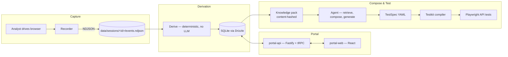

# Backbencher — Architecture

A factual account of what the system is today. Where something is stubbed, naive, or deliberately
unbuilt, it says so. For the vocabulary used throughout, see [CONTEXT.md](../CONTEXT.md); for the
reasoning behind the load-bearing choices, see [docs/adr/](./adr).

---

## 1. What the system does

Capture real product usage, turn it into an API catalog a human annotates once, then compose new API
scenarios from that catalog in response to a plain-language goal, and compile the approved ones into
runnable Playwright tests.



Two invariants run through every layer:

**Derived facts and human knowledge are separate, layered records.** Re-running derivation never
overwrites an annotation. Every consumer reads a merged view in which human input wins.

**Determinism everywhere except the model call.** Derivation, pack building, dependency
reconciliation, and compilation are pure functions. The LLM proposes; deterministic code validates.

---

## 2. Monorepo layout

```
backbencher/
├── bb.config.jsonc          recorder, llm models/tasks, environments
├── CONTEXT.md               domain glossary
├── docs/adr/                architecture decision records
├── apps/cli/                @backbencher/cli — the `bb` binary
├── packages/
│   ├── schemas/             Zod contracts; depends on no other package
│   ├── shared/              config, logger, ids, dataDir
│   ├── llm/                 provider adapters + per-task model routing
│   ├── derive/              deterministic derivation pipeline
│   ├── store/               Drizzle schema + repositories (SQLite)
│   ├── agent/               retrieval, composition, packs, spec generation
│   ├── testkit/             TestSpec → Playwright compiler, runtime, runner
│   ├── recorder/            Playwright capture
│   ├── portal-api/          Fastify + tRPC server
│   └── portal-web/          React + Vite analyst UI
└── data/                    gitignored: backbencher.db, sessions/, knowledge-packs/
```

Build order, which is also the dependency order: schemas → shared → llm → derive → store → agent →
testkit → recorder → portal-api → portal-web → cli. Packages resolve each other through compiled
`dist/`, so a package must be rebuilt before its dependents observe a change (ADR-0003).

---

## 3. Contracts — `packages/schemas`

Zod schemas with `z.infer` types, parsed at every boundary. `SCHEMAS_VERSION = "1.0.0"`; a
`schemaRegistry` map drives JSON Schema generation for non-TypeScript consumers, chiefly the prompt.

- **`recording.ts`** — `RecordingMetaSchema` (requires `name` and `goal`), `ApiRequestEventSchema`
  (`correlationId`, method, url, headers, postData), `ApiResponseEventSchema` (`correlationId`,
  status, `bodyKind`, `bodyBytes`).
- **`apimodel.ts`** — `PathTemplateSchema`, `OperationSchema` (request/response schemas per status,
  query params, `authObserved`, `volatileResponseFields`), `DataflowEdgeSchema` (`evidenceCount`,
  `valueEntropyOk`), `ObservedFlowSchema`.
- **`knowledge.ts`** — the domain split of ADR-0002:
  - `CatalogAnnotation` — `name`, `does`, `productArea`, `sideEffect`, `suggested`, `reviewState`.
  - `TestingAnnotation` — `testingGuidance`, `paramDocs`, `correctionOverrides`, `tags`.
  - `CatalogReviewState = "unannotated" | "ready" | "ignored"`.
  - `isOperationReady(a)` — the canonical gate on composer selection: true when an annotation exists,
    is not `suggested`, is not `ignored`, and has both a `name` and a `does`.
  - `catalogReviewStateFor(a)` — derives the review state. **Review state is computed, never set by
    hand.**
  - `Composition` (proposed; must be approved with a `TestDecision` before it can become a test).
- **`pack.ts`** — `KnowledgePackSchema` (catalog, operations, referenceSessions, compositions, guides,
  dataflow, environments, `contentHash`).
- **`testspec.ts`** — `TestSpecSchema` (steps with request/extract/expect/poll, `jsonAssertions`,
  `cleanup[]`).

---

## 4. Capture — `packages/recorder`

`startRecording(opts) → Promise<RecorderHandle>` launches Chromium headed, attaches `context`-level
request/response listeners, and streams validated NDJSON through a serialized write queue to
`data/sessions/<id>/events.ndjson`.

Capture is API-only; there is no UI instrumentation, no injected script, and no locator capture
(ADR-0004). Emitted event types are exactly `api_request` and `api_response`.

- **`apiFilter.ts`** — host allowlist with wildcards, resource type `xhr`/`fetch`, path allow/drop
  patterns, drops `OPTIONS`. Configured under `recorder.apiFilter`.
- **`bodyCapture.ts`** — reads the body eagerly inside the response handler, which avoids Playwright's
  evicted-body trap; stores it in full; classifies `json|text|binary|empty|unavailable`. Binary bodies
  are dropped, with `bodyBytes` recorded.
- Status encodes capture failure modes: `0` for a request that failed at the network layer, `-1` for a
  request still in flight when `stop()` drains.
- `stop({ name, goal })` **requires both** and throws otherwise; `discard()` abandons the run. This is
  the only record of intent that survives, so it is mandatory rather than prompted-and-skippable.

Covered by one live-browser e2e test, which is why the recorder is excluded from the standard test
sweep.

---

## 5. Derivation — `packages/derive`

Deterministic and LLM-free. `runDerivation(sessions)` in `pipeline.ts`:

1. **`pairCalls.ts`** — joins request to response on `correlationId`. The prototype's URL-plus-
   timestamp heuristic, which mis-paired concurrent identical requests, is structurally impossible
   here.
2. **`templatize.ts`** — parameterizes a path segment only when it both regex-matches
   uuid/numeric/hex/tokenish across ≥2 distinct values **and** is corroborated, either by all values
   being id-ish or by one appearing as a scalar in some response body. Deliberately biased toward
   *under*-templatizing: an analyst can merge Operations in the portal, whereas silent over-merging is
   unrecoverable.
3. **`operationId.ts`** — `sha1(method + host + template).slice(0, 12)`.
4. **`inferSchemas.ts`** — unions JSON Schemas per operation per status. `required` means present in
   ≥95% of observations, not present once. Also derives query params, `authObserved`, content types.
5. **`volatile.ts`** — groups calls with an identical request shape, diffs the response bodies, and
   flags differing JSON paths as volatile (timestamps, generated ids, cursors).
6. **`dataflow.ts`** — indexes response scalars and headers as producers, request path/query/body/
   header scalars as consumers, and joins on exact value where `producer.timestamp <
   consumer.timestamp`. An entropy gate drops values shorter than 6 characters, booleans, small
   integers, common words, and dates; `valueEntropyOk` is set only above length 8. Also emits
   `clientGeneratedFields` — values that vary per request with no producer anywhere in the corpus.
7. **`flows.ts`** — the per-session ordered call chain, collapsing ≥3 consecutive identical
   operationIds into one step with `repeated: n`.
8. **`dependencies.ts`** — `deriveDependencyGraph(...)` aggregates per-call dataflow edges into
   catalog-level `CatalogDependencyEdge`s keyed by `operationId`, and infers a **role** for each: an
   `auth-token` when the value flows into an `Authorization` header or cookie or the producer's
   `sideEffect` is auth, a `resource-id:<area>` when it is a path or id parameter consumed by
   same-area operations. This is what makes composition possible.
9. **`sessionGraph.ts`** — `buildSessionCallGraph(...)`, the single-session variant retaining exact
   correlationIds, used by the portal's session graph view.
10. **`jsonpath.ts`** — `walkScalars(...)`, producing normalized leaf paths with array indices
    collapsed to `[*]`.
11. **`probe.ts`** — optional and gated. Replays idempotent GETs twice against a live environment for
    a higher-confidence volatility mask, restricted to Operations tagged `probe-safe`.
12. **`redundant.ts`** — finds Calls that re-produce values an earlier Call of the same Operation already
    produced. Applied only to the per-Session artifacts, never to the Catalog.
13. **`curatedEvents.ts`** — materialises `curated-events.ndjson` per Session and reads it back.

`store.saveDerivation()` then transactionally full-replaces `operations`, `dataflowEdges`,
`observedFlows`, `dependencyFacts`, and `sessionCallEdges`. It never touches annotation, composition, or guide
tables. Operations, schemas, and dataflow come from raw events; `ObservedFlow` and `SessionCallEdge[]`
come from curated Calls.

This package has the strongest test coverage in the repo.

---

## 6. Store — `packages/store`

Drizzle over SQLite at `data/backbencher.db`. JSON columns hold Zod-validated payloads.

Tables: `sessions`, `operations`, `dataflowEdges`, `observedFlows`, `dependencyFacts`,
`catalogAnnotations`, `testingAnnotations`, `compositions`, `rehearsalGoals`,
`rehearsalResults`, `analystGuides`, `embeddings`, `knowledgePacks`, `testSpecs`, `testRuns`,
`auditLog`, `session_curation`, `session_call_edges`.

Repositories on the store object: `sessions`, `operations`, `dataflow`, `flows`, `dependencyFacts`,
`annotations` (catalog), `testingAnnotations`, `compositions`, `rehearsal`, `guides`,
`embeddings`, `packs`, `specs`, `runs`, `audit`.

`mergeOperation(derived, catalog?, testing?)` is the single merge-rule implementation. Catalog fields
are additive; testing `correctionOverrides` *replace* the derived `pathTemplate`, required query
params, and ignore fields; `reviewState: "ignored"` excludes the Operation from packs. Every portal
mutation appends to `auditLog`.

Embedding vectors live in `embeddings`, keyed by `(kind, entityId)` with `model` and `textHash`.
`EmbeddingKind` is `"operation" | "session"`. Cache invalidation is implicit: changed annotation text
or a changed model misses the cache and re-embeds. Do not add explicit re-embed hooks.

---

## 7. Portal

### 7.1 `packages/portal-api` — Fastify + tRPC on `/trpc`

Auth is a Fastify `onRequest` hook in `server.ts` checking `x-portal-token` or a Bearer token, with
`/health` exempt. **It is only enforced when a token is configured** via `opts.portalToken` or
`PORTAL_TOKEN`; with no token set, the API is open. That is acceptable for a local single-analyst
deployment and is not acceptable for a hosted one.

Routers: `sessions` (list/get/timeline/graph plus in-process start/stop/discard recording), `derive`,
`operations` (list/get/**annotate**/**annotateTesting**/setReviewState/merge), `flows`,
`suggest` (run/accept), `guides`, `dataflow`,
`dependencies`, `compose` (propose/drafts/**approve**/reject), `pack` (build/list/diff), `specs`,
`agent.generate`, `runs` (with `guardEnvironment` refusing writes against non-destructive
environments), `security` (`authzMatrix`, `bolaProbes`), `drift.report`, and `rehearsal`.

`compose.approve` requires a `TestDecision` — strategy, risk level, rationale, environments — because
per ADR-0002 the testing decision is made at approval, not at proposal.

Recording runs **inside the portal server process**, which is fine for one local analyst and is the
first thing to revisit for a hosted deployment. Derivation is triggered in the background by
`sessions.stopRecording`; `derive.run` no longer exists.

"Background" here means *deferred*, not *concurrent*. The job is scheduled with `setImmediate` so the
mutation's response flushes first, but the pass itself is synchronous CPU-bound work on the event
loop: while it runs it blocks every other request, including the `derive.status` polls the UI uses to
watch it. That is acceptable at the session-corpus sizes this tool is built for, and is a known
limitation — real concurrency means a worker thread, which is not attempted here.

### 7.2 `packages/portal-web` — React + Vite, hash-routed

Screens: Dashboard, Sessions (list, timeline, graph, start/stop recording), Catalog, OperationDetail
(the annotation editor), Compose (goal → proposal → approve with a test decision), Guides,
Pack, Specs.

No automated tests. `vite build` does not typecheck, so correctness here rests on
`pnpm --filter @backbencher/portal-web typecheck`.

---

## 8. Agent — `packages/agent`

**Retrieval** (`embed.ts`) — `retrieveForGoal(store, goal, opts)` embeds the goal, takes the top-K
Operations and Reference Sessions by cosine similarity, then **expands by transitive dependency closure**, so a
goal that never mentions authentication still pulls in the login Operation that its writes require.
`localEmbed` is lexical trigram hashing: a test-only default, never for a real corpus. Only Ready
Operations and reference-ready Sessions enter the corpus.

**Composition** (`compose.ts`) — `proposeScenario(store, goal, opts)`. Builds a prompt from the goal,
the closure-expanded candidate pool, few-shot Reference Sessions, and authoritative dependency facts; the model
selects and orders; then `reconcileDependencies()` deterministically auto-inserts a missing producer
where exactly one high-confidence candidate satisfies a slot, and records anything else as an
**unmet dependency** or a **candidate gap** rather than guessing. The result persists as a
`Composition` with `status: "draft"`.

**Dependencies** (`dependencies.ts`) — `computeDependencyGraph(store)` derives per-Operation
`requires`, `produces`, and `clientGenerated`.

**Annotation suggestion** (`suggest.ts`) — `suggestAnnotations(store, opts)` proposes catalog
annotations in bulk. A suggestion is written with `suggested: true` and therefore **never makes an
Operation Ready** until a human accepts it.

**Rehearsal** (`rehearsal.ts`) — `runRehearsal(store, opts)` runs held-out goals through the composer
and records whether each produced zero gaps and zero unmet dependencies, alongside a human verdict.
This is the corpus-quality measurement of ADR-0005.

**Packs** (`pack.ts`) — `buildKnowledgePack` merges Operations with annotations, excludes `ignored`,
includes approved Compositions and dataflow edges with `evidenceCount ≥ 2`, hashes canonical JSON to a
16-character content hash, and writes `pack.json` plus a human-readable `catalog.md`. `packDiff` is
shallow — added/removed/changed operationIds by serialized comparison, with no field-level diff.

**Spec generation** (`generate.ts`) — `generateTestSpec(store, compositionId, opts)` assembles context
from the catalog, in-scope `must_read` guides, the Composition, and one-hop dataflow neighbours; the
model emits TestSpec YAML only. `validateSpec()` checks operationId validity, forward-only step
references, declared extracts, and write-implies-cleanup. On failure there is exactly one automatic
repair round-trip; a still-invalid spec is persisted with `status: "invalid"` for a human.

---

## 9. Testkit — `packages/testkit`

- **`compiler.ts`** — emits a Playwright API-mode `.spec.ts` that delegates all real logic to the
  shared runtime. Model output never becomes executable code directly; determinism lives in
  `runtime.ts`, not in generated files.
- **`runtime.ts`** — executes steps sequentially: resolves `{{steps.x.extract.y}}`, `{{env.KEY}}`,
  `{{faker.*}}`, `{{now.iso}}` templates, where **an unknown template throws** — the main guardrail
  against hallucinated references. Mints fresh values for `clientGeneratedFields` at run time
  regardless of what the model wrote. Polls with bounded backoff, never unbounded. Asserts status and
  schema conformance via `ajv`, with volatile and ignored fields relaxed out of `required` and
  stripped before validation.
- **`runner.ts`** — `runWithQuarantine` retries once; a pass on retry is recorded as `flaky`, not
  `failed`. `guardEnvironment` refuses write-capable specs against `destructive: false` environments.
- **`security.ts`** — entirely deterministic, no model involved. `generateAuthzMatrix` replays every
  write Operation under every other auth profile expecting 401/403; `generateBolaProbes` substitutes a
  foreign resource id expecting a non-200.

---

## 10. LLM — `packages/llm`

Owns **all** provider and embedding SDK access; no other package may import a provider SDK
(ADR-0001). Adapters: Anthropic, Anthropic on Vertex, Google, Google on Vertex, and
OpenAI-compatible. `createLlmRegistry(config).forTask(task)` routes per task, where `LlmTask` is
`compose | generateSpec | suggestAnnotation | stepIntents | embed`, so a cheap model can do bulk
annotation while a stronger one composes. `LlmComplete` is injectable, so every test runs without an
API key.

---

## 11. CLI — `apps/cli`

```
bb record [--url <u>] [--profile <p>] [--name <n>] [--goal <g>]
bb derive [--session <id> | --all] [--probe --env <n>]
bb embed [--rebuild]
bb serve [--port 4000]
bb agent generate --composition <id> [--model <m>] [--provider anthropic|vertex]
bb test compile --spec <file|dir>
bb test run [--env <name>] [--grep <pattern>]
bb security authz|bola [--env <name>]
bb export knowledge-pack [--out <dir>]
```

Subcommands are lazily imported for fast startup. `bb embed` doubles as a credentials smoke test.
`bb test run` calls `runSpecAgainstEnv` in process rather than shelling out to `npx playwright test`.

The CLI has no tests of its own, so only `build`/`typecheck` catch breakage in it — worth remembering
after any cross-cutting rename.

---

## 12. Invariants that are easy to violate

Each of these has been got wrong at least once, or would be by anyone who didn't know it.

1. **Review state is derived, never assigned.** Use `catalogReviewStateFor()`; gate composer
   selection with `isOperationReady()`.
2. **A suggested annotation never makes an Operation Ready.** Machine proposals wait for a human.
3. **Derivation must never write to human tables.** `saveDerivation` full-replaces derived tables
   only.
4. **Annotations key on `operationId` and must survive re-derivation.** If a template override changes
   an id, migrate annotations by the old→new map in the same transaction.
5. **A client-generated value is not an unmet dependency.** An idempotency key with no producer is
   minted fresh downstream; treating it as unmet produces spurious gaps on every composition.
6. **Client-generated values are minted at run time regardless of the model's output.** Defence in
   depth against replayed identifiers.
7. **Never let raw capture-scale data near the model.** The pack catalog plus on-demand detail is the
   contract. An oversized prompt means retrieval is too loose, not that the budget is too small.
8. **Capture verbatim.** No redaction, no body cap. Sessions hold live credentials, so `data/` stays
   gitignored and recordings use non-production accounts (ADR-0006).
9. **Under-templatization fragments dependencies.** If `/tickets/{id}` was not templatized, every id
   becomes its own Operation and the dependency edges shatter. Re-run derivation after a portal merge.
10. **Don't let a topological sort override a valid model ordering.** Real product flows carry
    ordering information a topo sort discards; reorder only to fix an actual violation.
11. **Flake is not failure.** Quarantine before reporting, or the results lose credibility.
12. **Safety rails live in deterministic code, not in prompts.** Environment destructiveness, auth
    matrices, and cleanup requirements are enforced by the compiler and runner.

---

## 13. Known gaps

1. `drift.report` computes real coverage metrics — total, reviewed, annotation-ready,
   example-covered, dependency-resolvable, and with an approved Composition — but **OpenAPI
   reconciliation is unimplemented**: `hasSpec` is always false and `observedNotInSpec`,
   `specNeverObserved`, and `undocumentedFields` are always empty.
2. `packDiff` is shallow; no field-level diff.
3. Client-generated minting in `runtime.ts` is a flat top-level `randomUUID()`, not JSONPath-aware for
   nested or array fields.
4. Quarantine is a single blind retry, not idempotency-aware, so a genuinely broken write endpoint can
   be misreported as flaky.
5. Portal auth is off entirely when no token is configured, and recording runs in the server process.
   Both block a hosted deployment.
6. `portal-web` has no automated tests; `apps/cli` has none either.
7. `suggest` and `rehearsal` have no CLI entry points; they are portal-only.

---

## 14. History

The system began as a two-file JavaScript prototype: a Playwright recorder that captured UI events
alongside network traffic, and a filter that paired requests to responses by URL and timestamp. That
code has been deleted, but several current choices are direct reactions to how it failed —
correlationId-based pairing and entropy-gated dataflow exist because the prototype got those wrong.
Capture-time redaction and body truncation were later removed for the reasons in ADR-0006.
See ADR-0003, ADR-0004, and ADR-0006.
