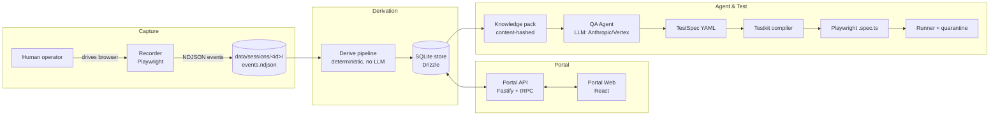

# Backbencher — Architecture (current implementation, as of 2026-07-28)

**Purpose of this document:** a single, factual account of what the system *actually is today* —
implementation status, not aspiration — merged from the original prototype report
(`TECHNICAL_REPORT.md`) and the target-design doc (`FURTHER_ARCHITECTURE.md`). Most of the target
design is now built. This doc is meant to be fed to another LLM/architect as the ground truth for
the next round of architectural changes. Where the current implementation deviates from, simplifies,
or stubs out the original plan, that is called out explicitly (`⚠`).

---

## 1. What the system does

A two-sided pipeline: **capture real product usage → turn it into machine-checkable API knowledge →
let an LLM author test scenarios against that knowledge → compile & run them as Playwright API
tests.**



Core invariant carried through every layer: **derived facts and human-authored knowledge are
separate, layered records.** Re-running derivation never overwrites analyst annotations; every
consumer reads a merged view where human input wins.

---

## 2. Monorepo layout (current)

```
backbencher/
├── package.json               # workspace root; ⚠ still has legacy "record"/"filter" scripts (dead)
├── pnpm-workspace.yaml, turbo.json, biome.json, tsconfig.base.json
├── bb.config.jsonc            # fully populated: recorder, redaction, agent, environments
├── apps/cli/                  # @backbencher/cli — the `bb` binary
├── packages/
│   ├── schemas/                # Zod contracts, zero deps on other packages
│   ├── shared/                 # logger, config loader, redaction, ids
│   ├── recorder/                # Playwright capture (bb record)
│   ├── derive/                  # deterministic derivation pipeline
│   ├── store/                   # Drizzle schema + repos (SQLite)
│   ├── portal-api/              # Fastify + tRPC server
│   ├── portal-web/              # React/Vite analyst UI
│   ├── agent/                   # knowledge pack builder + LLM TestSpec generation
│   └── testkit/                 # TestSpec → Playwright compiler, runtime, runner, security generators
├── data/                        # gitignored: backbencher.db, sessions/, knowledge-packs/
└── src/                         # ⚠ LEGACY v1 prototype — dead code, see §9
```

Dependency direction: `schemas ← shared ← {recorder, derive, store} ← {portal-api, agent, testkit} ← cli`.
`portal-web` depends only on `schemas` types + the tRPC router type from `portal-api`.

---

## 3. Data contracts (`packages/schemas/src`)

Zod schemas, `z.infer<>` for types, `.parse()`/`.safeParse()` at every package boundary.
`SCHEMAS_VERSION = "1.0.0"`; a `schemaRegistry` map drives JSON Schema generation.

- **`recording.ts`** — `RecordingMetaSchema` (sessionId, startUrl, authProfile, recorderVersion=2),
  `ApiRequestEventSchema` (correlationId, method, url, headers, postData, `headersSource: "sync"|"all"`),
  `ApiResponseEventSchema` (correlationId, status, bodyKind, bodyTruncated, `-1` for flushed-pending,
  `0`/`unavailable` for failed requests), `UiEventSchema` (locators, redacted value, `intentLabel`),
  `NavigationEventSchema`, `PopupEventSchema`, `MarkerEventSchema` (operator step boundaries).
- **`apimodel.ts`** — `PathTemplateSchema` (param kind: uuid/numeric/slug/opaque), `OperationSchema`
  (operationId, requestSchema, responseSchemas per status, queryParams, authObserved,
  volatileResponseFields), `DataflowEdgeSchema` (producer/consumer with `evidenceCount`,
  `valueEntropyOk`), `ObservedFlowSchema` (per-session step chain with `precedingUiIntent`, `repeated`).
- **`knowledge.ts`** — `OperationAnnotationSchema` (reviewState, correctionOverrides,
  testingGuidance), `AnalystGuideSchema` (scope, priority: must_read/reference),
  `ScenarioSchema` (steps with `intent`, `testDecision`: strategy/riskLevel/environments).
- **`pack.ts`** — `KnowledgePackSchema` (catalog, operations, flows, guides, dataflow, authProfiles,
  environments, `contentHash`).
- **`testspec.ts`** — `TestSpecSchema` (steps with request/extract/expect/poll,
  `jsonAssertions`, `cleanup[]`).

No dedicated schema unit tests; correctness is exercised indirectly via `agent`/`testkit` tests.

---

## 4. Capture — `packages/recorder`

`startRecording(opts): Promise<RecorderHandle>` — launches Chromium (headed by default), injects a
single bundled instrumentation script (`injected.generated.ts`, source `injected/instrument.ts`) via
`context.addInitScript`, wires `context.exposeBinding("__bbLogUiEvent", ...)`, and streams validated
NDJSON events through a serialized `WriteQueue` to `data/sessions/<id>/events.ndjson`.

- **`apiFilter.ts`** — host allowlist (wildcards), resourceType (xhr/fetch), path allow/drop
  patterns, drops `OPTIONS`. Matches `bb.config.jsonc`'s `recorder.apiFilter`.
- **`bodyCapture.ts`** — eager body read inside the response handler (avoids the evicted-body trap),
  caps at `bodyCapBytes`, classifies `json|text|binary|empty|unavailable`, redacts before storing.
- Redaction happens **at capture time** for network data (Node side) and **in the browser** for UI
  values (password fields / configured selectors never cross the exposeBinding bridge).
- Auto-intent: an `ObservedFlow` step inherits the nearest `ui_event`/`marker` within a 3s window
  (implemented in `derive/pairCalls.ts`, not the recorder itself).
- `RecorderHandle.addMarker(label)` — operator can label steps live; `stop()` drains and finalizes.
- ⚠ Pending/never-responded requests are flushed as `status: -1` at stop — implemented but not
  exhaustively exercised.
- ⚠ No explicit cross-origin-iframe handling beyond what `context`-level listeners give for free.
- Test coverage: one e2e test (`recorder.e2e.test.ts`) against a live browser + mock server.

---

## 5. Derivation — `packages/derive` (deterministic, no LLM)

Verified pass order in `pipeline.ts`:

```
loadSessions → pairCalls → templatizePaths → inferSchemas → volatileFields
             → dataflowGraph → observedFlows → persist
```

1. **`loadSessions.ts`** — reads `meta.json` + `events.ndjson`, validates every line against the
   schemas.
2. **`pairCalls.ts`** — joins `api_request`/`api_response` by `correlationId` (no URL/timestamp
   heuristic — the v1 pairing bug is structurally gone), attaches `precedingUiIntent` from the
   nearest `ui_event`/`marker` within 3000ms.
3. **`templatize.ts`** — parameterizes a path segment only if **both** (a) it regex-matches
   uuid/numeric/hex/tokenish across ≥2 distinct values, **and** (b) either all values are "id-ish" or
   at least one also appears as a scalar in some response body (corroboration). Biased toward
   *under*-templatizing on purpose — analysts fix via `operations.merge` in the portal rather than
   the pipeline over-merging silently.
4. **`operationId.ts`** — `sha1(method + host + template).slice(0, 12)`, stable while the template
   is stable.
5. **`inferSchemas.ts`** — unions JSON Schemas per operation per status code; `required` = present in
   ≥95% of observations; derives `queryParams`, `authObserved`, `contentTypes`.
6. **`volatile.ts`** — groups calls by identical request shape, diffs response bodies, flags JSON
   paths that differ as volatile (timestamps, generated ids, cursors).
7. **`dataflow.ts`** — indexes response scalars/headers as producers and request path/query/body/
   header scalars as consumers, joins on exact value with `producer.timestamp < consumer.timestamp`.
   Entropy gate (drop len<6, booleans, small ints, common words, dates); `valueEntropyOk` only for
   len>8. Also emits `clientGeneratedFields` (values that vary per-request with no producer anywhere
   — the compiler must mint these fresh, never replay them).
8. **`flows.ts`** — per-session ordered call chain; collapses ≥3 consecutive identical operationIds
   into one step with `repeated: n`.
9. **`probe.ts`** — optional, gated: replays idempotent GETs twice against a live environment for
   higher-confidence volatility masks; only for operations analysts have marked safe.
10. **`persist.ts`** — full-replace transactional write of `operations`/`dataflow_edges`/
    `observed_flows` into the store (never touches annotation/scenario/guide tables).

Test coverage is the strongest in the codebase here: `pipeline.test.ts`, `templatize.test.ts`,
`dataflow.test.ts`, `volatile.test.ts`, `schemaBuilder.test.ts`, `probe.test.ts`.

⚠ Deviation: OpenAPI reconciliation (`bb derive --openapi`, drift report) described in the original
plan is **not implemented** in `derive` — see §8 `driftRouter` stub.

---

## 6. Store + Portal

### 6.1 Store (`packages/store`, Drizzle + SQLite, `data/backbencher.db`)

Tables: `sessions, operations, operation_annotations, dataflow_edges, observed_flows, scenarios,
analyst_guides, knowledge_packs, test_specs, test_runs, audit_log`. JSON-typed columns hold
Zod-validated payloads. `saveDerivation()` does a transactional full-replace of the three derived
tables. `mergeOperation(derived, annotation)` is the single merge-rule implementation: annotation
fields (`displayName`, `description`, `productArea`, `testingGuidance`, `correctionOverrides`) win;
`reviewState: "ignored"` excludes an operation from packs. Every portal mutation appends to
`audit_log` (entityType/entityId/action/actor/diff).

### 6.2 Portal API (`packages/portal-api`) — Fastify + tRPC on `/trpc`

Auth: single shared token via `x-portal-token`/Bearer header, checked in a Fastify `onRequest` hook
(`/health` exempt). 13 routers:

`sessions` (list/get/timeline **+ live start/stop recording in-process**), `derive.run`,
`operations` (list/get/annotate/setReviewState/**merge**), `flows`, `scenarios`
(**including `fromFlow` — prefills a scenario draft from an `ObservedFlow`**), `guides`, `dataflow`,
`pack` (build/list/diff), `specs` (get/list/updateYaml/approve), `agent.generate`, `runs`
(start/get/listBySpec, with `guardEnvironment` refusing writes against non-destructive envs),
`security` (`authzMatrix`, `bolaProbes` — deterministic generators, no LLM), and **`drift.report` —
⚠ stubbed: returns a hardcoded empty report, not implemented.**

⚠ Notable deviation: recording is driven **from the portal server process itself**
(`sessions.startRecording`/`stopRecording`), not just the CLI — the plan implied CLI-only capture.

### 6.3 Portal Web (`packages/portal-web`) — React + Vite, hash-routed, 8 screens

`Dashboard`, `Sessions` (list + timeline viewer, start/stop recording), `Catalog` (operation browser),
`OperationDetail` (annotation editor), `ScenarioBuilder` (flow → scenario), `Guides`, `Pack`
(build/diff viewer), `Specs` (list + approve). No automated test coverage for this package; validated
manually / via typecheck (`pnpm --filter @backbencher/portal-web typecheck`).

---

## 7. Agent — `packages/agent`

**`buildKnowledgePack(store, opts)`** — merges `operations ⊕ annotations`, excludes `ignored`,
includes only `approved` scenarios, includes dataflow edges with `evidenceCount ≥ 2`, hashes canonical
JSON (sorted keys/arrays) to a 16-char content hash, writes `data/knowledge-packs/<hash>/pack.json`
+ `catalog.md`. `packDiff(a, b)` — ⚠ present but shallow: reports added/removed/changed operationIds
by string-comparing serialized payloads; no field-level diff.

**`generateTestSpec(store, scenarioId, opts)`** — ⚠ **key architectural fact**: this takes an
existing `scenarioId`, not free text. The LLM's job is narrower than "figure out the flow" — a human
must already have created a `Scenario` (via the portal, or `scenarios.fromFlow`) with its
`operationId` sequence and `intent` per step *before* the agent runs. What the LLM actually does:

1. `assembleContext(store, scenario)` builds a prompt from: the full compact operation catalog,
   `must_read` guides in scope, the scenario object itself, full merged detail docs for the
   scenario's operations + their 1-hop dataflow neighbors, and strategy-specific guidance
   (`api_functional` / `api_negative` / `authz` / `contract_only`).
2. The LLM emits TestSpec YAML only (hard system-prompt constraints: never invent operationIds,
   only chain via declared `{{steps.x.extract.y}}`, mint fresh values for client-generated fields,
   every write step needs cleanup).
3. `validateSpec()` checks operationId validity, forward-only step references, declared extracts,
   write-implies-cleanup. On failure: **one** automatic repair round-trip with errors appended to the
   prompt; still-invalid specs are persisted with `status: "invalid"` for a human to fix in the
   portal.
4. Provider dispatch (`createLlm`) supports Anthropic direct or Vertex AI; `LlmComplete` is injectable
   so tests run without any API key.

Test coverage: `generate.test.ts` (context assembly, validation, repair loop, mocked LLM),
`pack.test.ts` (build determinism, catalog markdown).

---

## 8. Testkit — `packages/testkit`

- **`compiler.ts`** — `compileToPlaywright(spec, ctx)` emits a Playwright Test API-mode `.spec.ts`
  that delegates all real logic to a shared runtime import (LLM output never becomes runnable code
  directly — determinism lives in `runtime.ts`, not in generated files).
- **`runtime.ts`** — `runTestSpec(spec, ctx)` executes steps sequentially: resolves templates
  (`{{steps.x.extract.y}}`, `{{env.KEY}}`, `{{faker.uuid}}`, `{{faker.email}}`, `{{now.iso}}` —
  unknown templates throw, the main guardrail against hallucination), mints fresh values for
  `clientGeneratedFields` **at compile/run time regardless of what the LLM wrote** (defense in
  depth), builds the HTTP request (path/query/headers/body + auth from `BB_AUTH_<PROFILE>_*` env
  vars), polls with a bounded backoff loop (never infinite), extracts via JSONPath, asserts status +
  schema conformance (via `ajv`, with `volatileResponseFields`/`ignoreFields` relaxed out of
  `required` and stripped before validation) + `jsonAssertions`.
  ⚠ Client-generated minting is a flat `randomUUID()` at the top level of the body — does not walk
  nested paths/array indices intelligently.
- **`runner.ts`** — `runWithQuarantine`: retries once on failure; pass-on-retry is recorded as
  `"flaky"` not `"failed"`. `guardEnvironment` refuses to run write-capable specs against
  `destructive: false` environments. ⚠ Flake detection is a single blind retry, not idempotency-aware.
- **`security.ts`** — fully deterministic, **no LLM**: `generateAuthzMatrix` replays every
  write operation under every other auth profile expecting 401/403; `generateBolaProbes` swaps in a
  foreign resource id expecting a non-200. Both driven purely off pack data.
- **`assertions.ts`** — `applyJsonAssertions`, `checkSchemaConformance`, `jsonPathFirst`.

Test coverage: `runtime.test.ts`, `compiler.test.ts`, `runner.test.ts`, `security.test.ts`.

---

## 9. CLI — `apps/cli/src/index.ts` (`bb`)

All subcommands are real, lazily-imported for fast startup:

```
bb record [--url] [--profile] [--session-name]
bb derive [--session <id> | --all] [--probe --env <name>]
bb serve [--port]
bb agent generate --scenario <id> [--model] [--provider anthropic|vertex]
bb test compile --spec <id>
bb test run [--env] [--spec] [--grep]
bb security authz|bola [--env]
bb export knowledge-pack [--out]
```

⚠ `bb test run` does **not** shell out to `npx playwright test` — it calls `runSpecAgainstEnv`
in-process directly, reporting passed/flaky/failed counts. No dedicated CLI tests exist; covered
indirectly by `portal-api`'s acceptance tests.

---

## 10. Known gaps / stubs / architectural open questions

These are the concrete things a re-architecting pass should decide on, in priority order:

1. **No free-text "figure out the flow" capability.** `generateTestSpec` requires a pre-existing,
   human-authored `Scenario`. There is no `proposeScenario(freeTextGoal)`-style function that lets
   the LLM search `catalog`/`dataflow`/past `ObservedFlow`s to synthesize a *candidate* scenario. All
   flow discovery is manual today (`ScenarioBuilder` screen, `scenarios.fromFlow`).
2. **`driftRouter.report()` is a hardcoded stub** — no OpenAPI reconciliation, no coverage-gap
   detection, despite being in the portal's router surface and dashboard plan.
3. **`packDiff` is shallow** — string-equality change detection per operationId, no field-level diff
   rendering (the portal's Pack screen presumably wants more than "changed: yes/no").
4. **Client-generated value minting is naive** (`runtime.ts`) — flat top-level `randomUUID()`, not
   JSONPath-aware for nested/array fields.
5. **Quarantine is a single blind retry**, not idempotency- or side-effect-aware; could misclassify a
   truly-broken write endpoint as merely "flaky".
6. **Legacy dead code still in the tree** (`src/recorders/recorder.js`, `src/filters/filter-api.js`,
   plus the root `package.json` `record`/`filter` scripts pointing at them). Superseded entirely by
   `packages/recorder`; safe to delete, not yet removed. See §11 for what they historically did/why
   they existed, since some of their known bugs informed the current design.
7. **Portal recording runs in the server process.** `sessions.startRecording/stopRecording` launches
   a headed browser from inside `portal-api` — worth revisiting for multi-analyst/hosted deployments
   (currently fine for a single local analyst).
8. **No schema-level tests** in `packages/schemas` itself; correctness is only exercised transitively.
9. **`portal-web` has zero automated test coverage.**

---

## 11. Appendix — Legacy v1 prototype (superseded, dead code)

For historical context only — this is what existed before the TypeScript rewrite and is why several
"conservative by design" choices exist upstream (correlationId-based pairing, entropy-gated
dataflow, redaction-at-capture, etc.). **Not part of the current runtime.**

- `src/recorders/recorder.js` — plain JS, Playwright, `chromium.launch({ headless:false,
  args:["--ignore-certificate-errors", "--disable-web-security", ...] })`, hardcoded
  `DEFAULT_URL` pointing at an internal tenant. In-memory `events[]`, saved once on ENTER/SIGINT to
  `recordings/recording-<epochMs>.json`. Captured `api_request`/`api_response` (paired only by
  Playwright's live `Map<Request, event>`, **not persisted as a correlation id**), `ui_event`
  (locators: xpath/css/id/tag/text/dataTestId/name; 1000ms debounce on `input`), `navigation`,
  `popup`/`popup_navigation`.
- `src/filters/filter-api.js` — post-processed a raw recording into
  `recording-<epochMs>-api-calls.json` by pairing `api_request`/`api_response` via **exact URL match
  + `timestamp >=`**, picking the first not-yet-consumed response — a heuristic that could mis-pair
  concurrent identical-URL requests.
- **Known bugs fixed by the rewrite:** (1) `text.startsWith("{") || text.startsWith("[")` operator
  precedence throwing on null `text` (silently caught, wrong logic) — gone under `strictNullChecks`
  and a rewritten body handler; (2) ~200 lines of injected locator/listener script duplicated between
  `addInitScript` and the popup `page.evaluate` path — now one bundled `injected.generated.ts`;
  (3) URL+timestamp response pairing — replaced by `correlationId` minted per request; (4) a
  header-mutation race where `allHeaders()` resolved on a later microtask and could overwrite headers
  after save — now resolved-or-timeout before the event is frozen and written; (5) `package.json`
  declared `main: index.js` with no such file; (6) hardcoded tenant URL — now `bb.config.jsonc` +
  `--url`; (7) asymmetric body truncation (JSON stored unbounded, text capped at 1000 chars) — now
  symmetric `bodyCapBytes` with explicit `*Truncated` flags; (8) many silent `catch` blocks — now
  logged via pino at `warn` with a `recorder_warning` counter in the session summary.
- **Security issues that motivated the redaction module:** passwords recorded in cleartext
  (`sanitizeValue()` was a no-op stub, never called), cookies/OAuth `code=` params and bearer tokens
  present verbatim in committed sample recordings, TLS/CORS validation disabled by default. All fixed
  in v2 via `shared/redaction.ts`, applied at capture time (network) and in-browser (UI values), plus
  `data/` being gitignored.
- **Gaps that were never carried forward as-is** (deliberately re-scoped, not just fixed): no
  replay/playback of UI locators was ever built downstream (replay strategy is API-only, so locator
  capture in `ui_event` is now vestigial — see the earlier discussion on whether full UI-event capture
  is still worth its cost); no HAR export; no config layer (fixed in v2); no de-duplication of noisy
  static-asset calls (now handled by `apiFilter`'s drop patterns).
