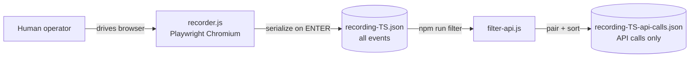

# Technical Report — Session Recorder + API Call Filter ("backbencher")

**Status:** Prototype / working proof-of-concept
**Runtime:** Node.js + Playwright (`playwright@^1.57.0`)
**Repository name (package.json):** `project_2` (v1.0.0)
**Purpose of this document:** Give architects (and other LLMs) a precise, implementation-level account of what exists today, how each piece works, the exact data contracts produced, and the known limitations/edge cases.

---

## 1. Executive Summary

The repository implements a two-stage pipeline:

1. **Recorder** ([src/recorders/recorder.js](src/recorders/recorder.js)) — Launches a real Chromium browser via Playwright, lets a human manually drive a web application, and passively records **three classes of events** into an in-memory array: network API calls (request + response), DOM UI interactions (click/input/change/keypress), and navigation/popup lifecycle events. On ENTER (or SIGINT) it serializes the whole session to `recordings/recording-<epochMs>.json`.

2. **Filter** ([src/filters/filter-api.js](src/filters/filter-api.js)) — Post-processes a raw recording, discards everything except `api_request`/`api_response` events, pairs each request with its matching response, sorts chronologically, and writes `recordings/recording-<epochMs>-api-calls.json`.

There is **no test suite, no build step, no CI, no linting, no TypeScript**. The two scripts are standalone Node entry points wired via `npm` scripts. Dependencies: only `playwright`.



---

## 2. Repository Layout

```
backbencher/
├── package.json                # name=project_2; deps: playwright only; scripts: record, filter
├── README.md                   # User-facing usage docs
├── src/
│   ├── recorders/recorder.js   # Stage 1: capture session -> recording-<ts>.json
│   └── filters/filter-api.js   # Stage 2: extract API calls -> *-api-calls.json
└── recordings/                 # Output artifacts (committed sample data present)
    ├── recording-1784817237750.json          # raw sample (58 events)
    ├── recording-1785167030745.json          # raw sample
    ├── recording-1785170441513.json          # raw sample (36 events)
    └── recording-1785170441513-api-calls.json# filtered sample (13 API calls)
```

`package.json` scripts:

| Script | Command | Meaning |
|--------|---------|---------|
| `record` | `node src/recorders/recorder.js` | Start a recording session (optional URL arg) |
| `filter` | `node src/filters/filter-api.js` | Filter a recording (requires input file arg) |

There is **no `index.js`** despite `package.json` declaring `"main": "index.js"`.

---

## 3. Stage 1 — Recorder (`src/recorders/recorder.js`)

### 3.1 Entry & configuration

- `DEFAULT_URL` is hardcoded to an internal environment:
  `https://maple-aio-2-m1.otxlab.net:443/saw/ess?TENANTID=223791286`.
  Overridable via `process.argv[2]` (`node src/recorders/recorder.js <url>`).
- `RECORDINGS_DIR = <repo>/recordings` (resolved via `path.join(__dirname, "..", "..", "recordings")`), auto-created by `ensureDir()` if missing.
- `sanitizeValue()` exists as a stub (returns the value unchanged) — a placeholder for future password masking. **Currently NOT called anywhere**, so raw input values (including passwords) are recorded verbatim (see §7 Security).

### 3.2 Browser launch (TLS-permissive)

```js
chromium.launch({
  headless: false,
  args: ["--ignore-certificate-errors",
         "--ignore-certificate-errors-spki-list",
         "--disable-web-security"],
});
context = browser.newContext({ ignoreHTTPSErrors: true });
```

- **Non-headless** by design (human-in-the-loop).
- Aggressively disables TLS validation and web security (CORS) so it can drive internal/self-signed environments. This is a deliberate testing convenience but is a hardening concern for any non-lab use.

### 3.3 State model

Three pieces of in-memory state inside `record()`:

- `events: Array<Event>` — the ordered append-only event log (the eventual output).
- `apiRequestMap: Map<PlaywrightRequest, requestEvent>` — correlates Playwright `request` objects to their recorded event object so the `response` handler can (a) know the request was API-relevant and (b) enrich it.
- `saved: boolean` — idempotency guard so ENTER + SIGINT don't double-save.

### 3.4 API request capture — `page.on("request")`

Filter logic determines "is this an API call":

```js
isApi = resourceType === "xhr" || resourceType === "fetch" || url.includes("/api/");
```

For matching requests it pushes an `api_request` event **immediately** (synchronously) so ordering/correlation is preserved, then:

- Captures `request.method()`, `url`, `resourceType`, synchronous `request.headers()`, and `request.postData()` (wrapped in try/catch; may be `null`).
- Registers the event in `apiRequestMap`.
- Fires `request.allHeaders()` asynchronously and, on resolve, **overwrites** `requestEvent.headers` with the fuller header set. Rationale noted in code: `allHeaders()` only resolves once the response returns, so it must not block the initial correlation. On failure it silently keeps the sync headers.

> **Implementation nuance:** Because `headers` is mutated on a later microtask, the serialized header set for a given request depends on whether `allHeaders()` resolved before `saveAndExit()` ran. In practice it always resolves first, but it is a latent race.

### 3.5 API response capture — `page.on("response")`

- Ignores any response whose `request` is not in `apiRequestMap` (i.e., non-API or already-consumed).
- Reads `response.status()`.
- Body handling:
  ```js
  const text = await response.text();
  if (text && text.startsWith("{") || text.startsWith("[")) { try JSON.parse; catch -> text.substring(0,1000) }
  else responseBody = text ? text.substring(0,1000) : null;
  ```
  - **Known bug (operator precedence):** the condition is `(text && text.startsWith("{")) || text.startsWith("[")`. If `text` is `null`/empty, the right operand `text.startsWith("[")` throws; it's caught by the surrounding try/catch (so `responseBody` stays `null`), but the intent was clearly `text && (starts with { or [)`. Functionally tolerable, semantically wrong.
  - JSON responses are stored as **parsed objects**; non-JSON or unparseable bodies are truncated to **1000 chars**.
- Pushes an `api_response` event with `url` (from the request), `status`, `headers` (sync `response.headers()`), and `responseBody`.
- `apiRequestMap.delete(request)` — consumes the correlation entry so a later duplicate response for the same request object won't re-match.

### 3.6 UI event capture (in-page instrumentation)

Two-layer bridge:

1. **`context.exposeFunction('logUIEvent', cb)`** — exposes a Node-side callback to **all pages** in the context. The in-page code calls `window.logUIEvent(data)`; the Node callback wraps it into a `ui_event` with `type` + server-side `timestamp: Date.now()` and appends to `events`.

2. **`attachUIListeners(page, label)`** — uses `page.addInitScript()` to inject a self-contained script into **every future document/navigation** of that page. The injected script defines locator generators and DOM listeners.

**Locator strategies generated per element** (best-effort, multiple for resilience):

| Field | Source |
|-------|--------|
| `xpath` | `//*[@id="..."]` if element has `id`, else a full positional path built by walking `parentNode` and counting same-tag preceding siblings |
| `css` | `#id` if present, else up to 5 ancestor levels of `tag.class1.class2.class3` + `:nth-of-type(n)` |
| `id` | `element.id` |
| `tag` | lowercased tag name |
| `text` | `innerText` trimmed to 50 chars |
| `dataTestId` | `data-testid` or `data-test-id` attribute |
| `name` | `name` attribute |

Plus `value` (current field value) and `position` (viewport center `{x,y}` from `getBoundingClientRect`).

**DOM listeners** (all attached in capture phase, `true`):

- `click` → capture immediately.
- `input` → **debounced 1000 ms** per element (via a `Map<element, timeoutId>`) so the recorded `value` is the settled text, not each keystroke.
- `change` → captured immediately (on blur/commit); clears any pending input debounce for that element first.
- `keydown` with `key === "Enter"` → captured as `action: "keypress"` with `{ key: "Enter" }`, also flushing pending debounce.

### 3.7 Navigation, popups, and multi-page handling

- **Main-frame navigation:** `page.on("framenavigated")` filtered to `page.mainFrame()` pushes a `navigation` event `{ url }`.
- **Popups / new windows:** `context.on("page")` handles each new page:
  - Increments `popupCounter`, assigns label `popup<N>`.
  - Pushes a `popup` event `{ action: "opened", url, popupId }`.
  - Waits for `load` (10 s timeout, tolerant) then `waitForTimeout(1000)`.
  - Calls `attachUIListeners(newPage, popupLabel)` for **future** docs, **and** additionally does a one-time `newPage.evaluate(...)` that injects a **duplicated copy** of the same locator+listener script into the **already-loaded** popup document (init scripts only apply to future navigations, so the current document needs the imperative injection).
  - Tracks `popup_navigation` events and a `popup` `{ action: "closed" }` event on close.

> **Notable duplication:** The entire locator-generator + listener block exists **twice** — once inside `addInitScript` (§3.6) and once inside the popup `evaluate` (§3.7). They are near-identical; any change must be made in both. This is the single largest refactor candidate (extract to a shared injected-script string/module).

### 3.8 Shutdown & serialization — `saveAndExit()`

- Guarded by `saved`. Triggered by `readline` `line` event (ENTER) or `SIGINT`.
- Builds the output object (see §5.1), including `meta.userAgent` obtained via `page.evaluate(() => navigator.userAgent)` (falls back to `"unknown"`).
- Writes pretty-printed JSON (`JSON.stringify(recording, null, 2)`), prints an event-type histogram to the console, closes the browser, `process.exit(0)`.

---

## 4. Stage 2 — Filter (`src/filters/filter-api.js`)

### 4.1 Algorithm

```js
requests  = events.filter(type === "api_request")
responses = events.filter(type === "api_response")
usedResponses = Set()

apiCalls = requests.map(req => {
  response = responses.find(res =>
      !usedResponses.has(res) &&
      res.url === req.url &&
      res.timestamp >= req.timestamp)   // first unused response, same URL, at/after request time
  if (response) usedResponses.add(response)
  return { method, url, requestTimestamp, requestHeaders, postData,
           status, responseHeaders, responseBody, responseTimestamp }
})
apiCalls.sort((a,b) => a.requestTimestamp - b.requestTimestamp)
```

- **Pairing key:** exact `url` string equality + `response.timestamp >= request.timestamp`, choosing the **first not-yet-consumed** response. `usedResponses` prevents two requests from claiming the same response.
- Unmatched requests still emit a record with `status/responseHeaders/responseBody/responseTimestamp = null`.
- Output is sorted ascending by `requestTimestamp`.

### 4.2 I/O

- Input: `process.argv[2]` (required; exits 1 with usage if absent).
- Output: `process.argv[3]` if given, else `<inputDir>/<inputBasename>-api-calls.json`.
- Emits console summary (source path, total events, API calls found, output path).

### 4.3 Pairing limitations (important for architects)

- **URL is not a unique key.** Multiple identical-URL requests (e.g., polling the same endpoint) are matched purely by order + timestamp. Since matching iterates `requests` in array order and picks the earliest unused same-URL response, near-simultaneous identical requests can be mis-paired (request A could get request B's response if timestamps interleave). There is no use of a request/response identity handle from Playwright in the filter stage (that correlation existed at record time via `apiRequestMap` but is **not** persisted — the JSON has no correlation id).
- **Recommended hardening:** persist a monotonic `requestId`/correlation id in both `api_request` and `api_response` events at record time so the filter can pair deterministically instead of by URL+timestamp heuristic.

---

## 5. Data Contracts (exact schemas)

### 5.1 Raw recording — `recording-<epochMs>.json`

```jsonc
{
  "meta": {
    "url": "https://…",              // start URL
    "timestamp": 1785170441513,       // epoch ms at save time (also the filename stem)
    "recordedAt": "2026-07-27T16:40:41.513Z",
    "userAgent": "Mozilla/5.0 …",
    "totalEvents": 36
  },
  "events": [ /* ordered, append-order; see event types below */ ]
}
```

Event variants (discriminated by `type`):

| `type` | Key fields |
|--------|-----------|
| `navigation` | `timestamp`, `url` |
| `api_request` | `timestamp`, `method`, `url`, `resourceType`, `headers{}`, `postData` |
| `api_response` | `timestamp`, `url`, `status`, `headers{}`, `responseBody` (parsed JSON object OR ≤1000-char string OR null) |
| `ui_event` | `timestamp`, `action` (`click`\|`input`\|`change`\|`keypress`), `pageType` (`main`\|`popup<N>`), `locators{xpath,css,id,tag,text,dataTestId,name}`, `value`, `position{x,y}`, optional `key` |
| `popup` | `timestamp`, `action` (`opened`\|`closed`), `url?`, `popupId` |
| `popup_navigation` | `timestamp`, `url`, `popupId` |

> All `timestamp` values are **Node-side `Date.now()` at capture time**, not browser event timestamps. This means UI event times reflect when the exposed function ran in Node, and API times reflect the Playwright event callback firing — good enough for ordering, but not sub-ms precise.

### 5.2 Filtered output — `recording-<epochMs>-api-calls.json`

```jsonc
{
  "meta": {
    "sourceFile": "recording-1785170441513.json",
    "sessionUrl": "https://…",
    "filteredAt": "2026-07-27T16:41:11.415Z",
    "totalApiCalls": 13
  },
  "apiCalls": [
    {
      "method": "GET",
      "url": "https://…/userProfile",
      "requestTimestamp": 1785170417629,
      "requestHeaders": { … },
      "postData": null,
      "status": 401,
      "responseHeaders": { … },
      "responseBody": null,
      "responseTimestamp": 1785170418673
    }
  ]
}
```

---

## 6. Observed real-world behavior (from committed samples)

- `recording-1785170441513.json`: 36 total events; filter produced **13** API calls. The captured flow is an SSO/login sequence against `te-smax-stg-m.otxlab.net/bo`: initial `GET /bo/userProfile` → **401**, redirect to `idm-service/idm/v0/login`, i18n asset fetch, public token exchange (`/idm-service/idm/v0/api/public/token?code=…`), then UI events for typing `username = "suite-admin"` and a password field.
- **Confirms live capture works** for: XHR/fetch APIs, cross-navigation flows, form input (with debounced value settling), and header/cookie capture (session cookies `JSESSIONID`, `CLIENT_ID`, bearer-style `code` params are all present in the JSON).
- Header ordering differs between samples (e.g., `1784817237750` shows a reduced header set) — consistent with the `headers()` vs `allHeaders()` timing described in §3.4.

---

## 7. Security & Privacy Considerations (flag for architects)

These are **material** because the tool captures real auth material into plaintext JSON committed to the repo:

1. **Secrets in artifacts.** Recorded `requestHeaders` include `cookie` (`JSESSIONID`, `CLIENT_ID`, `route`) and URLs include OAuth-style `code=` parameters. `responseBody` may include tokens. The committed sample files under `recordings/` already contain live-looking session identifiers.
2. **Passwords captured in cleartext.** `ui_event.value` records form input values; the `change`/`input`/`keypress` handlers do not distinguish `type="password"`. `sanitizeValue()` is a no-op stub and is never invoked. The sample shows `value: "Admin"` for a password field.
3. **TLS/CORS disabled** (`--ignore-certificate-errors`, `--disable-web-security`, `ignoreHTTPSErrors`). Acceptable only for controlled lab targets.
4. **No redaction/allow-list** on which headers or bodies are persisted.

**Recommended mitigations:** implement `sanitizeValue()` for password/secret fields and call it; redact `cookie`/`authorization`/`set-cookie` headers and token query params before serialization; add `recordings/` to `.gitignore` (or scrub committed samples); make TLS-permissive flags opt-in via an env flag.

---

## 8. Known Bugs / Fragilities (concrete)

| # | Location | Issue |
|---|----------|-------|
| 1 | recorder.js response body test | `text.startsWith("{") \|\| text.startsWith("[")` precedence — throws on null text (caught, but wrong logic; should be `text && (…)`). |
| 2 | recorder.js | ~200 lines of locator/listener code duplicated between `addInitScript` and popup `evaluate`. Divergence risk. |
| 3 | filter-api.js pairing | URL+timestamp heuristic can mis-pair concurrent same-URL requests; no persisted correlation id. |
| 4 | recorder.js headers | `requestEvent.headers` mutated on a later microtask (`allHeaders()`), producing a subtle race vs. save time. |
| 5 | package.json | `"main": "index.js"` but no `index.js` exists. |
| 6 | recorder.js | `DEFAULT_URL` hardcoded to a specific internal tenant. |
| 7 | Body truncation | Non-JSON bodies truncated to 1000 chars silently; large JSON stored fully (asymmetric, may bloat files). |
| 8 | No error surface | Many `catch` blocks swallow errors silently (headers, post data, body) — hard to diagnose gaps. |

---

## 9. What is NOT implemented (gaps)

- **No replay/playback** of recordings (the recorder captures locators + values that clearly anticipate replay, but nothing consumes them yet).
- **No test/codegen output** (e.g., generating a Playwright test or HAR from the recording).
- **No tests, no CI, no lint, no types.**
- **No config file** — all tuning is hardcoded (debounce 1000 ms, body cap 1000 chars, timeouts).
- **No de-duplication or noise filtering** of API calls (static assets that pass the `/api/` or xhr/fetch test are kept).
- **No streaming to disk** — the entire session is held in memory and written once at exit (fine for short sessions, unbounded for long ones).
- **No handling of iframes** (only main frame + popups; sub-frame UI events are not instrumented).

---

## 10. Suggested next steps (for discussion)

1. **Persist a correlation id** (`requestId`) on `api_request`/`api_response` to make filtering deterministic (§4.3).
2. **Extract the injected instrumentation** into one shared source to kill the duplication (§3.7, bug #2).
3. **Add redaction/sanitization** and `.gitignore` the recordings (§7).
4. **Introduce a config layer** (env or JSON) for URL, debounce, body caps, TLS flags.
5. **Decide the downstream consumer** of recordings — replayer? Playwright test codegen? HAR export? This determines whether the current locator schema is sufficient.
6. **Add minimal tests** for `filterApiCalls()` (pure function, easy to unit test with fixture recordings).

---

## Appendix A — Module exports

- `recorder.js` exports `{ record }` and self-runs `main()` when invoked directly (`require.main === module`).
- `filter-api.js` exports `{ filterApiCalls }` and self-runs on direct invocation. `filterApiCalls(inputFile, outputFile?)` is a pure-ish function (reads/writes files) returning the output path.

## Appendix B — Runbook

```bash
npm install                                             # installs playwright
npm run record                                          # record with DEFAULT_URL
node src/recorders/recorder.js https://your-app-url     # record custom URL
#   → interact in the opened browser, press ENTER in terminal to save
npm run filter recordings/recording-<timestamp>.json    # produce *-api-calls.json
```
